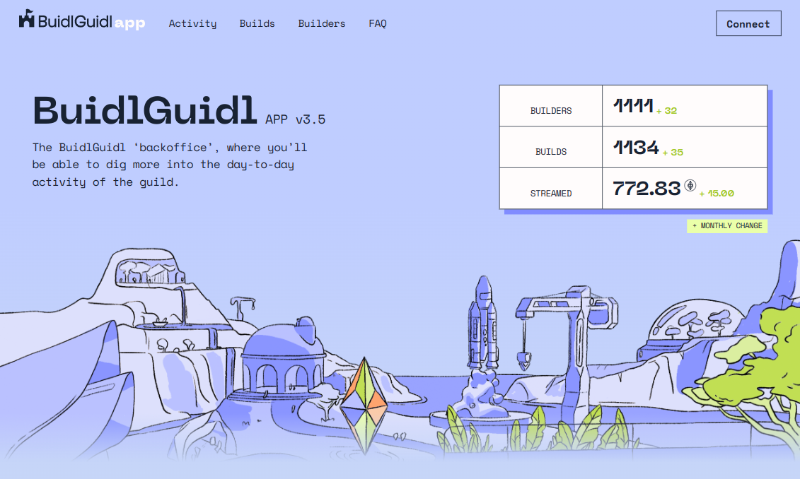

# BuidlGuidl v3

The 🏰 BuidlGuidl is a curated group of Ethereum builders creating products, prototypes, and tutorials with 🏗 [scaffold-eth](https://github.com/scaffold-eth/scaffold-eth)


---

## Prerequisites

[Node (v16 LTS)](https://nodejs.org/en/download/) plus [Yarn](https://classic.yarnpkg.com/en/docs/install/).

Every package in this monorepo (backend, hardhat, react-app) comes with a `.sample.env` file. The one inside `packages/backend` is the only one required to set up (copy it to `packages/backend/.env`). All the others work out of the box.

If you want to connect to a **local** firebase instance:
  - Install the [firebase CLI](https://firebase.google.com/docs/cli#install_the_firebase_cli)
  - Set `FIRESTORE_EMULATOR_HOST=localhost:8080` in `packages/backend/.env`
  - Seed the local firebase: Copy `packages/backend/local_database/seed.sample.json` to `packages/backend/local_database/seed.json` and tweak it as you need. You can always clean up the data in the Firestore UI and re-import by stopping & running `yarn backend` again.

If you want to connect to your **live** firebase instance:
 - Donwload the `serviceAccountKey.json` file from the Firebase UI
 - Comment out the `FIRESTORE_EMULATOR_HOST` env var.
 - Set `GOOGLE_APPLICATION_CREDENTIALS` to the correct path to your `serviceAccountKey.json`
 
## Project setup

Install dependencies:

```bash

yarn install

```

(Optional) Start the firebase emulators (vs set up a live Firebase instance)
```bash

firebase emulators:start

```

Start the backend service:

```bash

yarn backend

```

In a new terminal, start the frontend:

```bash

yarn start

```

At this point, the APP should be available at <http://localhost:3000>.
